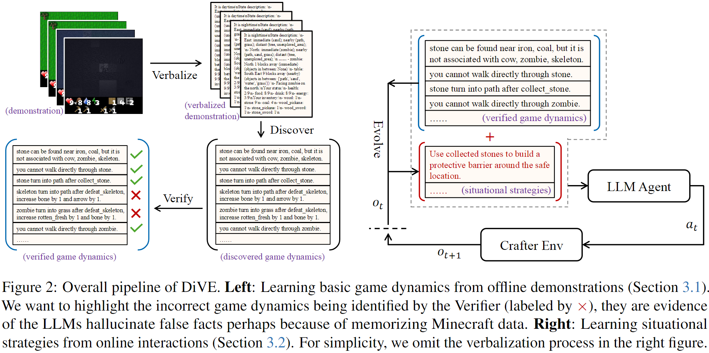

# Enhancing Agent Learning through World Dynamics Modeling

This repo contains code for our paper: [Enhancing Agent Learning through World Dynamics Modeling](https://arxiv.org/abs/2407.17695) 

## Abstract
Large language models (LLMs) have been increasingly applied to tasks in language understanding and interactive decision-making, with their impressive performance largely attributed to the extensive domain knowledge embedded within them. However, the depth and breadth of this knowledge can vary across domains. Many existing approaches assume that LLMs possess a comprehensive understanding of their environment, often overlooking potential gaps in their grasp of actual world dynamics. To address this, we introduce **Di**scover, **V**erify, and **E**volve (DiVE), a framework that **discovers** world dynamics from a small number of demonstrations, **verifies** the accuracy of these dynamics, and **evolves** new, advanced dynamics tailored to the current situation. Through extensive evaluations, we assess the impact of each component on performance and compare the dynamics generated by DiVE to human-annotated dynamics. Our results show that LLMs guided by DiVE make more informed decisions, achieving rewards comparable to human players in the Crafter environment and surpassing methods that require prior task-specific training in the MiniHack environment,

<p align="center">
  
</p>

## Running the Code
Follow the steps below to set up and run the code.
### 1. Install Dependencies
 Use pip to install the required packages:

> ```python
> pip install -r requirements.txt
> ```

### 2. Configure OpenAI API Key
To use OpenAI's services, you need to provide your API key.
1. Open the LLM/__init__.py file.
2. Add the following line, replacing "your-api-key-here" with your actual OpenAI API key:

> ```python
> OPENAI_API_KEY = "your-api-key-here"
> ```

### 3. Navigate to the LLM Directory

> ```python
> cd LLM
> ```

### 4.Run the Script
Execute the following command to start the program:

> ```python
> python act/act.py
> ```

### Citation
If you use this work in your research, please cite:
```bibtex
@inproceedings{sun2024enhancing,
  author    = {Zhiyuan Sun and Haochen Shi and Marc-Alexandre Côté and Glen Berseth and Xingdi Yuan and Bang Liu},
  title     = {Enhancing Agent Learning through World Dynamics Modeling},
  booktitle = {Findings of the Association for Computational Linguistics: EMNLP 2024},
  pages     = {3534--3568},
  year      = {2024},
  location  = {Miami, Florida, USA},
  publisher = {Association for Computational Linguistics}
}
```
